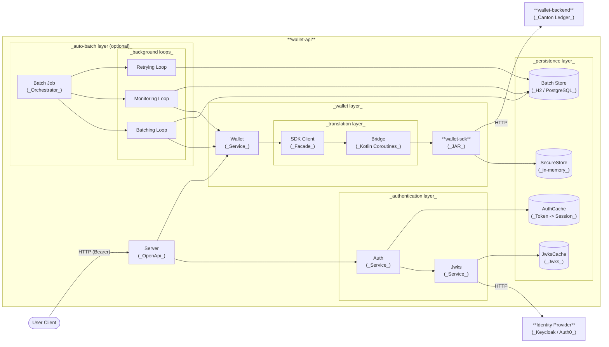

The service (`wallet-api`) acts as a bridge, wrapping the **Kotlin**-based `wallet-sdk-jvm` artifact inside a **Scala Cats Effect** runtime. It translates **HTTP** requests into `wallet-sdk` calls, which then communicate with the remote `wallet-backend`.

## System diagram

## Auto-Batch layer (optional)

When `AUTO_BATCH_SWITCH=true`, a `BatchOrdersJob` starts alongside the HTTP server. It orchestrates three concurrent background loops — `batchingLoop`, `monitoringLoop`, `retryingLoop` — that aggregate queued transfer orders into batched ledger submissions, track their progress, and retry or terminate them as needed.

State is persisted in a dedicated relational store (**H2 in-memory by default**, **PostgreSQL for production**). When auto-batch is disabled, this layer is entirely absent and the server behaves exactly as before this feature was introduced.

<Card title="Auto-Batch →" icon="layer-group" href="/enterprise-wallet/auto-batch">
</Card>

## Authentication layer

The service implements standard [OIDC](https://en.wikipedia.org/wiki/OpenID#OpenID_Connect_\(OIDC\)) authentication as an **optional** feature, allowing two operational modes:

<CardGroup cols={2}>
  <Card title="Strict Mode" icon="lock">
    The authentication layer acts as a gatekeeper, enforcing OIDC Bearer Token validation against an external Identity Provider (IdP).
  </Card>

  <Card title="Guest Mode" icon="lock-open">
    All authentication checks are skipped.
  </Card>
</CardGroup>

<Tip>
  To ensure low latency, the layer uses an **in-memory dual-layer caching strategy** for both public keys (JWKS) and validated sessions (JWT).
</Tip>

<Card title="Authentication →" icon="shield-halved" href="/enterprise-wallet/authentication">
</Card>

## Server bootstrap and initialization

On startup, the service performs a **cold-start recovery**. Because the underlying `SecureStore` is ephemeral (in-memory), the service must re-initialize the cryptographic identity and rediscover accounts from the ledger every time it boots.

This process is driven by **environment variables**, so the container stays stateless while the wallet identity is preserved via the **BIP39 standard**.

<Card title="Configuration →" icon="sliders" href="/enterprise-wallet/configuration">
</Card>