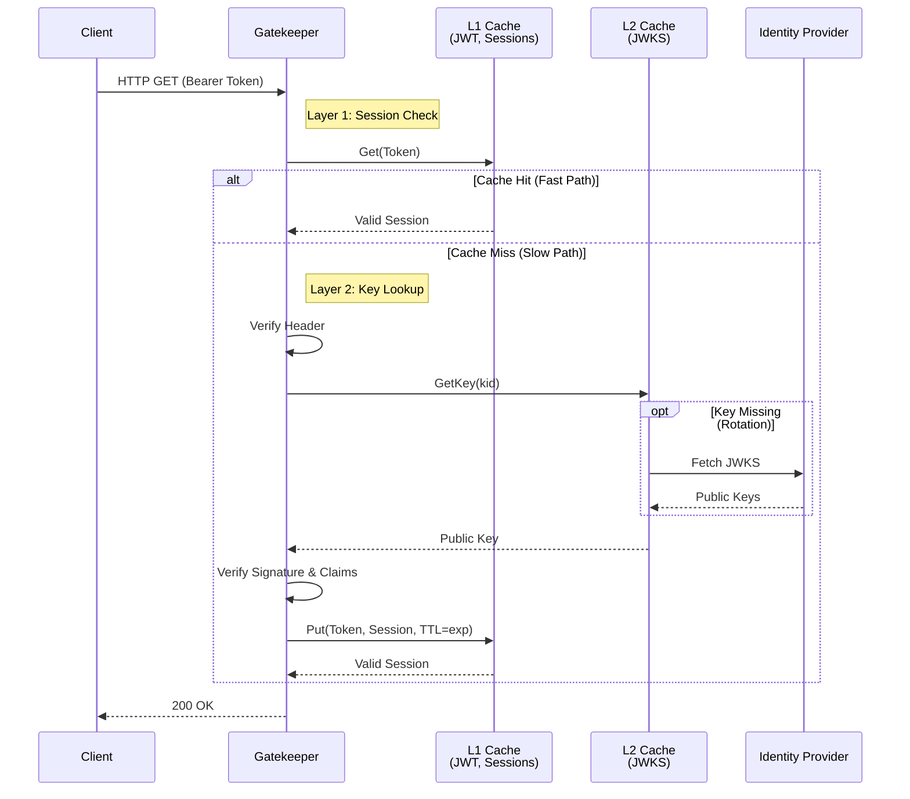

The service implements a configurable, **OIDC-compliant security layer** designed for Zero-Trust environments.

## Operational modes

Authentication is treated as a toggleable effect. The mode is determined strictly by the `AUTH_TYPE` environment variable.

<CardGroup cols={2}>
  <Card title="Strict Mode" icon="lock">
    `auth0` · `keycloak` · `custom`

    The service acts as a gatekeeper. All protected endpoints require a valid `Bearer` token in the `Authorization` header.
  </Card>

  <Card title="Guest Mode" icon="lock-open">
    `noop`

    The security layer defaults to a no-op provider, permitting all requests without validation.
  </Card>
</CardGroup>

## Performance and caching

To maintain sub-millisecond overhead, the validation logic avoids synchronous round-trips to the Identity Provider on every request. Instead, it uses a **dual-layer in-memory strategy**.

<CardGroup cols={2}>
  <Card title="L1 — Session cache" icon="bolt">
    Once a JWT is cryptographically verified, its valid state is cached until the token's natural expiration (`exp` claim). Subsequent requests with the same token **bypass signature verification entirely**.
  </Card>

  <Card title="L2 — JWKS cache" icon="key">
    Public keys (JSON Web Key Set) needed for verification are cached long-term and refreshed only if a token references an unknown Key ID (`kid`) — handling key rotation automatically.
  </Card>
</CardGroup>

## Request flow

