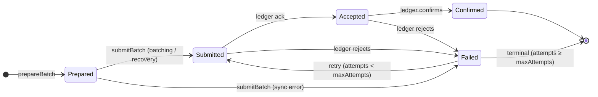

Auto-Batch is an optional background feature that automatically aggregates pending transfer orders into batched ledger submissions. Instead of one interactive transaction per transfer, up to `AUTO_BATCH_MAX_SIZE` transfers for the same party are collapsed into a single submission — significantly improving throughput under load.

## Enabling

Auto-Batch is **disabled by default** (`AUTO_BATCH_SWITCH=false`). When disabled, no background loops run and the HTTP server behaves exactly as before this feature was introduced.

```bash
AUTO_BATCH_SWITCH=true
```

## Database

The feature persists batch state in a relational store. Two backends are supported:

<CardGroup cols={2}>
  <Card title="in-memory (default)" icon="memory">
    An H2 database in PostgreSQL-compatibility mode. No extra infrastructure required. **State does not survive a restart.**
  </Card>

  <Card title="psql" icon="database">
    A PostgreSQL instance for persistent, production-grade storage. Set `AUTO_BATCH_DB_TYPE=psql`.
  </Card>
</CardGroup>

<Info>
  The default is `in-memory` for **backward compatibility**. Existing deployments can opt into auto-batching without provisioning a PostgreSQL instance.
</Info>

<Warning>
  The database is initialised on every startup (schema migrations apply automatically). In `in-memory` mode the store is empty after each restart — any in-flight batches from a prior run are not recovered.
</Warning>

## Batch lifecycle

An `Order` (a single transfer request submitted via the HTTP API) moves through two independent state machines:

| Entity | Terminal success | Terminal failure |
| --- | --- | --- |
| **Order** | `Dequeue` (picked up by a batch) | (released back to `Queued` if batch fails terminally) |
| **Batch** | `Confirmed` | `Failed` with `attempts ≥ maxAttempts` |



### Key invariants

- `attempts` is incremented **before** each submission attempt (atomically). Both synchronous errors (network, SDK) and asynchronous ledger rejections consume exactly one credit — no silent infinite retries.
- Every `update()` uses **optimistic locking** (keyed on `batch.updatedAt`) so the three concurrent loops never corrupt each other's state.

## Background loops

`BatchOrdersJob` spawns three loops in parallel. All loops share the same **exponential-backoff wrapper** (1 s → 60 s, with jitter) that activates on unhandled errors, preventing cascading failures from hammering downstream services.

<AccordionGroup>
  <Accordion title="batchingLoop" icon="layer-group">
    Prepares and submits one new batch per idle party per cycle. Also recovers `Prepared` batches with `attempts = 0` that were created before a restart.

    ```mermaid
    sequenceDiagram
        participant batchingLoop
        participant BatchOrdersWorker
        participant BatchStore
        participant OrdersStore
        participant WalletService
    
        loop every batchInterval
            batchingLoop->>BatchOrdersWorker: recoverPreparedBatches()
            BatchOrdersWorker->>BatchStore: searchByStatus(Prepared)
            note over BatchOrdersWorker: submit any stuck batches (attempts = 0, never flew)
    
            batchingLoop->>BatchOrdersWorker: prepareBatch()
            BatchOrdersWorker->>BatchStore: searchActives()
            note over BatchOrdersWorker,OrdersStore: exclude parties with any active batch
            BatchOrdersWorker->>OrdersStore: searchNextAvailables(excludedParties, limit)
    
            alt orders found for an idle party
                BatchOrdersWorker->>BatchStore: create(Batch, orderIds)
                note over BatchOrdersWorker,BatchStore: atomic: Batch(Prepared) + Order status → Dequeue
                batchingLoop->>BatchOrdersWorker: submitBatch(batchId)
                BatchOrdersWorker->>BatchStore: incrementAttempts(batchId)
                BatchOrdersWorker->>WalletService: batchSend(from, transfers)
                BatchOrdersWorker->>BatchStore: update(Submitted)
            else no idle orders
                batchingLoop->>batchingLoop: sleep(batchInterval)
            end
        end
    ```
  </Accordion>

  <Accordion title="monitoringLoop" icon="radar">
    Polls the ledger for every in-flight batch (`Submitted` or `Accepted`) and advances its state. Terminal outcomes (`Confirmed`, `Failed`) are written back; the retry loop handles `Failed`.

    ```mermaid
    sequenceDiagram
        participant monitoringLoop
        participant BatchOrdersMonitor
        participant BatchStore
        participant WalletService
    
        loop every monitorInterval
            monitoringLoop->>BatchStore: searchMonitoreables()
            note over BatchStore: Submitted + Accepted only
    
            loop each in-flight batch
                monitoringLoop->>BatchOrdersMonitor: monitorBatch(batchId)
                BatchOrdersMonitor->>WalletService: commandStatus(partyId, commandId)
    
                alt confirmed
                    BatchOrdersMonitor->>BatchStore: update(Confirmed)
                else failed
                    BatchOrdersMonitor->>BatchStore: update(Failed)
                    note over BatchOrdersMonitor: attempts already counted retryingLoop will handle retry
                else in-flight
                    BatchOrdersMonitor->>BatchStore: update(Accepted)
                end
            end
    
            monitoringLoop->>monitoringLoop: sleep(monitorInterval)
        end
    ```
  </Accordion>

  <Accordion title="retryingLoop" icon="rotate">
    Separates failed batches into two groups: those still within the retry budget are re-submitted; those that have exhausted `maxAttempts` are marked terminal and their orders are released back to `Queued`.

    ```mermaid
    sequenceDiagram
        participant retryingLoop
        participant BatchOrdersWorker
        participant BatchStore
        participant BatchOrdersStore
    
        loop every retryInterval
            retryingLoop->>BatchStore: searchFailed()
    
            loop terminal batches (attempts ≥ maxAttempts)
                retryingLoop->>BatchOrdersStore: searchIn(batchId)
                retryingLoop->>BatchStore: markAsFailedAndReleaseOrders(batchId, orderIds)
                note over BatchStore: atomic: status → Failed + orders → Queued
            end
    
            loop retriable batches (0 < attempts < maxAttempts)
                retryingLoop->>BatchOrdersWorker: submitBatch(batchId)
                retryingLoop->>retryingLoop: sleep(recoveryInterval)
            end
    
            retryingLoop->>retryingLoop: sleep(retryInterval)
        end
    ```
  </Accordion>
</AccordionGroup>

<Tip>
  Tune batch and retry timings via the `AUTO_BATCH_*` environment variables. See [Configuration](/enterprise-wallet/configuration#auto-batch).
</Tip>