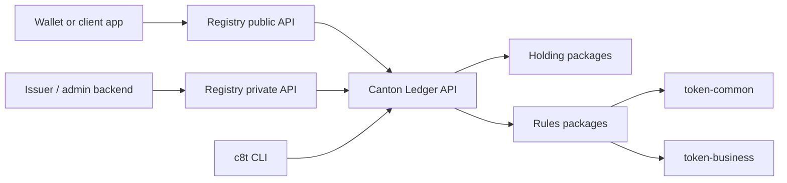

Token Factory is split into three layers: **DAML contracts**, the **registry API**, and **CLI / deployment tooling**.

## System diagram

## Two-layer DAML model

| Layer | Purpose | Upgrade behavior |
| --- | --- | --- |
| **Holding packages** | Define token identity and balance contracts (`Holding`, `LockedHolding`, `AutoAccept`). | **Stable.** Users own these contracts — deployed holding packages should not change casually. |
| **Rules packages** | Define operations: factory choices, transfers, allocations, freeze checks, mint, burn, migration. | **Upgradeable per token.** |
| `token-common` | Shared validation, decimal precision, freeze checks. | Shared dependency. |
| `token-business` | Shared settlement, merge/split, allocation, and `TokenOps` abstractions. | Shared dependency. |

<Info>
  Each token has its own holding/rules pair. This gives **type-level isolation**: a `c8BTC` holding cannot accidentally be used in a `c8ETH` operation.
</Info>