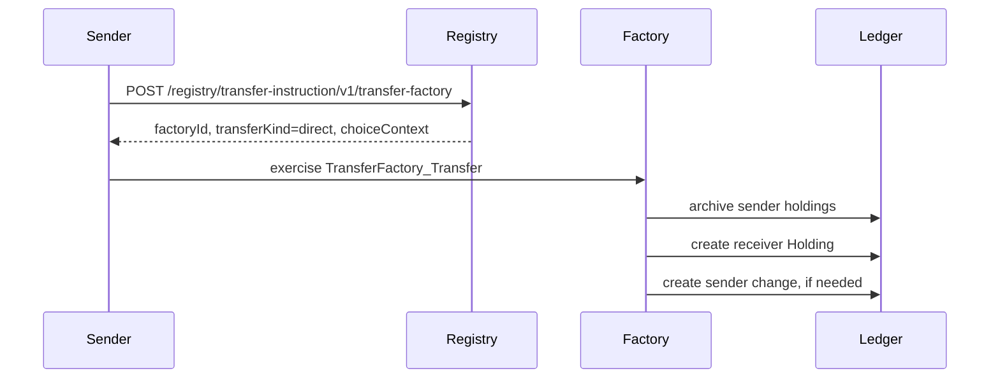
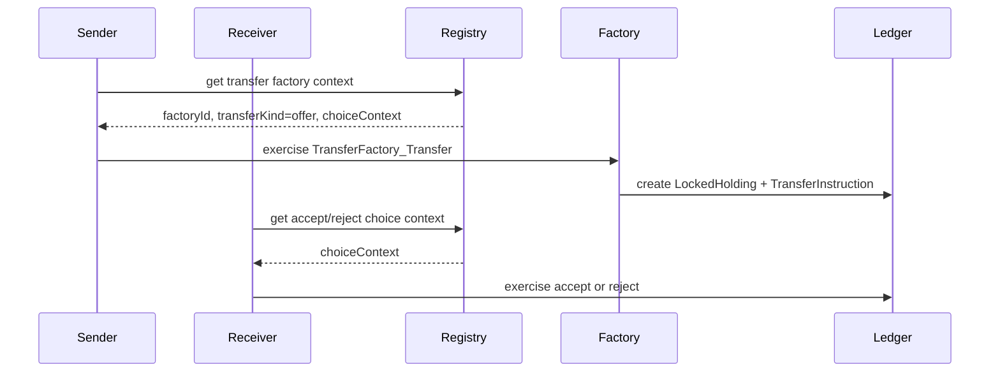
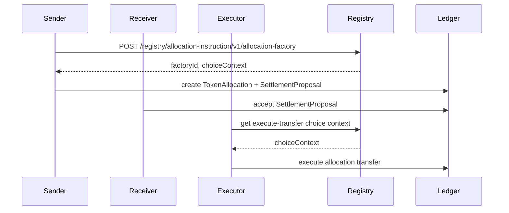

Token Factory supports three transfer patterns. The right one is chosen automatically by the registry based on the receiver's state.

<CardGroup cols={3}>
  <Card title="Direct" icon="bolt">
    Receiver has `AutoAccept` — holding is created in one transaction.
  </Card>

  <Card title="Offer" icon="envelope-open">
    Receiver must accept or reject a `TransferInstruction`.
  </Card>

  <Card title="Allocation" icon="handshake">
    Funds locked for atomic settlement or DvP workflows.
  </Card>
</CardGroup>

## Direct transfer

Used when the receiver has an `AutoAccept` contract.

## Transfer offer

Used when the receiver has not opted into auto-accept.

## Allocation and atomic settlement

Allocations reserve funds for settlement workflows such as DvP.

<Tip>
  The `transferKind` field returned by the registry tells your client which flow to follow: `self`, `direct`, or `offer`.
</Tip>